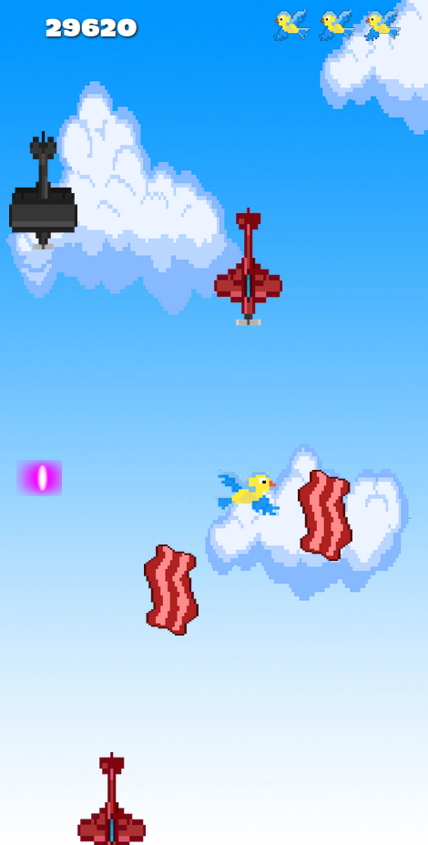
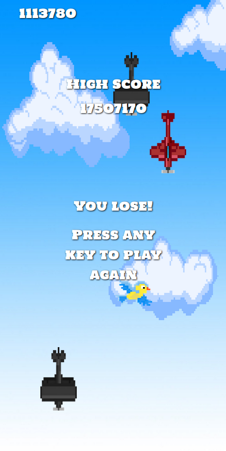
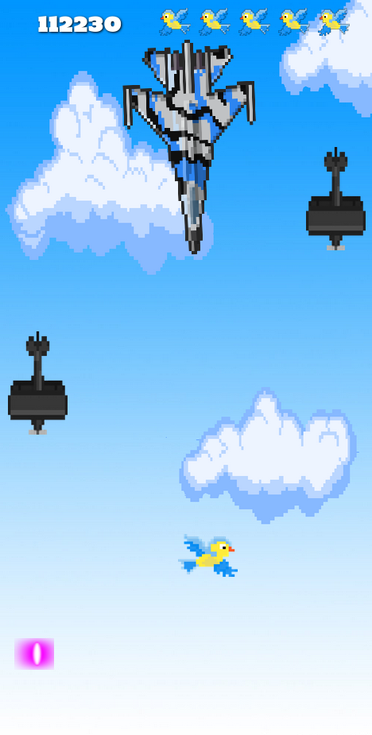
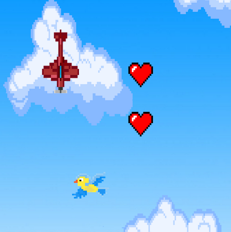

# Bird Strike
> Object Oriented Programming Game Written for Concordia University

<div align="center">
  
</div><br>

## Demo

[Play the Game Live](https://andrewbaldwin44.github.io/Bird_Strike_OOP_Game/)

## Controls

Fly around using the `arrow keys` and press `space` to shoot!

## Features

**_Fly through the Sky Collecting Bacon and Shooting Enemies With Lasers to Earn Points_**

<div align="center">
  
</div><br>

- Your high score will persist in Local Storage
- There are 4 different enemies to fight:
  - Red planes move at a normal speed
  - Yellow planes fly at mach speed
  - Black planes will shoot back
  - And...

**_The Boss!_**

<div align="center">
  
</div><br>

**_Enemies have a chance of dropping hearts. Replenish Your health!_**

<div align="center">
  
</div>

## Deploy the project

__Clone the repo to your local machine using the terminal__:
```
$ git clone git@github.com:andrewbaldwin44/Bird_Strike_OOP_Game.git
```

*Then Open the `index.html` Project File in Your Browser*

### Technologies Used:

- JavaScript
- HTML
- CSS

## Author

👤 **Andrew Baldwin**

- Github: [@andrewbaldwin44](https://github.com/andrewbaldwin44)
